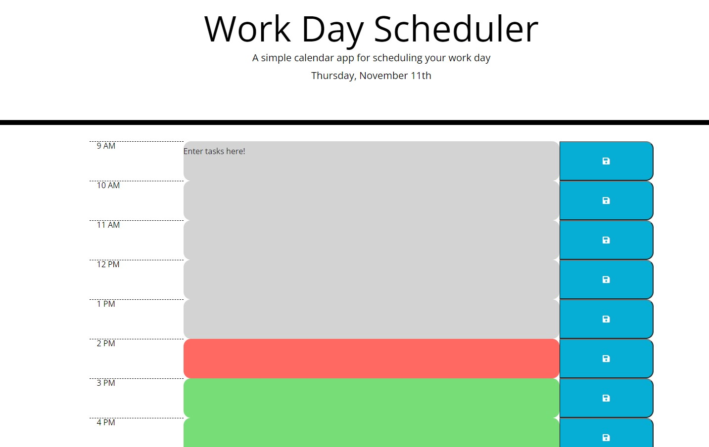

# Work Day Scheduler
## Purpose
To create an editable scheduler in which users can input hourly tasks that will then save into localStorage. User generated tasks will carry over between sessions. Each time block within the scheduler will be color coded using Moment.js to denote whether the tasks' time slots are in the past, present, or future. 

## Languages
- Javascript
- HTML
- CSS 

## Frameworks
- JQuery
- Bootstrap

### Deployed Site
Site deployed at [Work Day Scheduler](https://aucoats.github.io/workscheduler-challenge)

Image of deployed site: .
